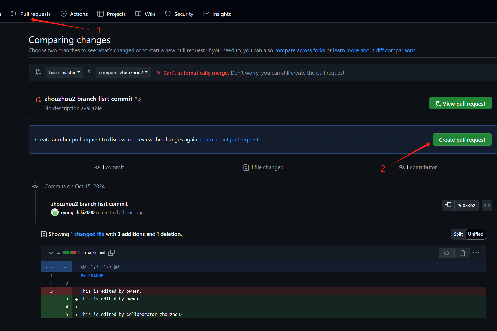

# 工作流程

## 1. 环境准备

在`git clone`本代码框架之后，请先根据`requirements.txt`安装所需的依赖包。
如果在你的开发过程中，你需要额外的依赖包，也请在`requirements.txt`中添加(或重新生成覆盖)。

## 2. 数据准备
考虑到数据集过分庞大，我没有将它上传到远程仓库

请通过[yelp](https://www.yelp.com/dataset)链接下载数据集，**并一定将`yelp_academic_dataset_business.json`和`yelp_academic_dataset_review.json`放在`resource/data`文件夹下**

## 3. Github Collaborator工作流程

### 3.1 Collaborator流程

在成为Collaborator之后，`git clone`本仓库到本地

#### 3.1.1 创建远程分支

**在远程仓库中创建一个新的分支**，比如`your_feature_name`，如下两图所示：


#### 3.1.2 本地分支与远程分支关联
## **请注意master分支为我们的主线，请务必务必不要在上面直接开发！！！**
在本地仓库中，使用以下命令 
`git checkout -b your_feature_name --track origin/your_feature_name` 来创建一个本地分支，并与远程分支关联

或者分成两步:
`git checkout -b your_feature_name` 创建本地分支
确保切换到你的分支后，再使用以下命令
`git branch --set-upstream-to=origin/your_feature_name your_feature_name`
## **请务必确保你在你的分支下进行开发！！！**

#### 3.1.3 开发与提交

**开发之前，请检查项目主线Master是否有更新**
`git fetch` && `git pull`来更新本地仓库

**请尽量避免和其他人在同一个文件中进行开发**(我已尽量模块化任务，优化ing)

在本地仓库中，开发你的功能，然后使用`git add`和`git commit`提交你的更改

`git commit`的message请确保准确描述，**并且请不要滥用git commit，不要提交过多commits**

如果想对上一个commit进行补充，请使用`git commit --amend`

**提交前请check是否已经track到正确的远程分支，再git push**
可以用`git branch -vv`来查看本地分支与远程分支的关联情况，如下
```
* zhouzhou2 9688362 [origin/zhouzhou2] zhouzhou2 branch fisrt commit
```
zhouzhou2分支已经track到origin/zhouzhou2分支
**或者使用`git push -u origin your_feature_name`**

#### 3.1.4 Pull Request
在github网页端，仓库的`pull request`选项，点击`New pull request`，**选择你的分支和主线Master分支**，创建一个pull request

## 然后就芜湖恭喜你了，你已经完成了你的任务，等待owner review你的代码吧！


### 3.2 reference

1. 请观看官方文档 https://docs.github.com/zh/pull-requests/collaborating-with-pull-requests/getting-started/about-collaborative-development-models 中的共享仓库模型部分
2. [一文带你了解什么Contributor什么是Collaborator](https://blog.csdn.net/qq_41230365/article/details/86766005#:~:text=collaborator%E6%A8%A1%E5%BC%8F%E9%80%82%E5%90%88%E7%94%A8%E4%BA%8E,%E7%9A%84%E6%96%B9%E5%BC%8F%E8%BF%9B%E8%A1%8C%E5%90%88%E4%BD%9C%E5%BC%80%E5%8F%91%E3%80%82)